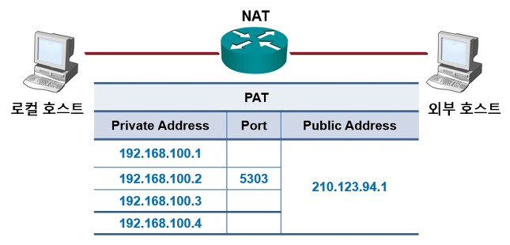
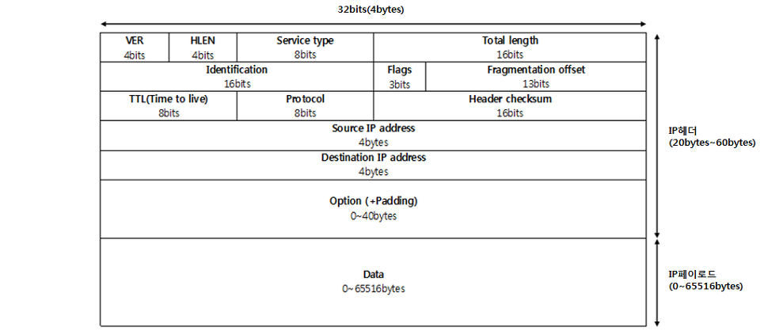
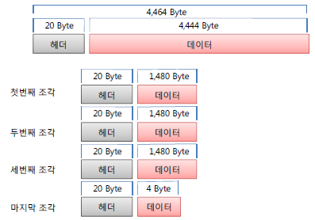

# IP

## Internet Protocol

ip는 osi  계층에서 호스트의 주소지정과

패킷분할 및 조립을 담당한다.

ip는 흐름에 관여하지 않아

제대로 갔는지 보장하지 않는다.
> 만약 보장하고 싶다면 상위 프로토콜인 TCP 를 사용한다
---

ip는 원래 전세계에서 유일한 정보를  
가지고 있어야 하지만 ip는 32bit 주소체계로 약42억 9천만개의 ip를 가지고있고 일부 번호들은 특별한 용도로 예약되어있어 모두 사용할 수 없다.
> 127.0.0.1 : localhost

그래서 이를 해결하기위하여 한네트워크에서만 사용하는 사설 ip를 사용한다. *ipv6 도있긴 한데....*
>사설ip대역
>
>A 클래스 : 10.0.0.0 ~ 10.255.255.255
>
>B 클래스 : 172.16.0.0 ~ 172.31.255.255
>
>C 클래스 : 192.168.0.0 ~ 192.168.255.255

사설 ip를 할당할때 NAT 이나 DHCP라는 방식을 사용하는데 
>NAT이란 사설 IP 주소공간을 별도로 정하고는, IP 주소변환하는 방식인데 NAT방식에는
>
> Static, Dynamic, PAT
방식이 있는데 PAT을 주로 사용한다.
>
>NET-PAT(Port Address Translation)
방식은 하나의 공인IP를 다수의 사설 IP가 공유하여 사용하는 방식 
>DHCP란 *(Dynamic Host Configuration Protocal)* ip 자동할당 및 분배 프로토콜로 기확보된 공인 IP 주소 Pool를 집단 공유하며, 사용후 반납

## IP Packet

VER(version):  보통 4( **ipv4** )

HLEN(Header Length): 헤드의 길이를 32비트 단위로 나타낸다. 대부분의 IP 헤더의 길이는 20바이트 입니다. 필드 값은 거의 항상5다
(5 * 32 = 160bit or 20Byte))

Type of service:  서비스의 우선순위 제공
(요즘은 거의 안씀)
>

<https://en.wikipedia.org/wiki/Differentiated_services>

TOL(total length): 전체 IP 패킷의 길이를 바이트 단위로 나타낸다

Identification:
보낼 정보가 커서 분할해서보낼때 다시 결합하기 위해 사용됨

Flags: 1 -> 단편화하지 않음 (DF), 2 -> 더 많은 조각 (MF)

Fragmentation Offset: 조각나기 전의  원래 데이터의 바이트 범위를 나타낸다.

TTL(time to live) : 데이터의 수명을 관장 라우터 1개에 도착하면 1을 TTL 필드를 1씩 

Protocal : https://en.wikipedia.org/wiki/IPv4#Data

Header Checksum : 오류검출을 위한 부분

(알고리즘은 https://en.wikipedia.org/wiki/IPv4_header_checksum#External_links)

Source address : source IP

Destination address : destination IP

Option : https://en.wikipedia.org/wiki/IPv4#Options
