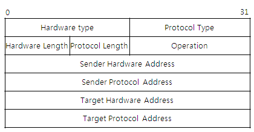
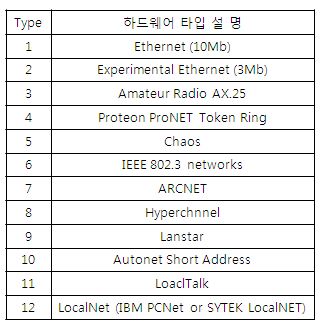

# ARP 
## Address Resolution Protocol

### 호스트나 라우터의 ARP Table을 refresh 하기 위해 사용된다 

## 1. HTYPE : 네트워크 유형 

## 2. PTYPE
어떠한 유형의 프로토콜(IPv4,IPv6,ATM, etc..)을 사용하는가 정의

ex) 0x0800 == [IPv4](./Ip.md)

## 3. HLEN
HTYPE 길이(in octets)
ex) Ethernet == 6

## 4. PLEN
PTYPE의 길이(in octets)
ex) IPv4 == 4

## 5. Operation
패킷의 유형

|num|protocol|
|:---:|:---|
|1|ARP Request|
|2|ARP Reply|
|3|RARP Request|
|4|RARP Reply|

## 6. SHA
발신자의 Hardware Address

## 7. SPA 
발신자의 IP Address

## 8. THA 
목적지 Hardware Address\
ARP Request의 경우 알수 없음 => padding

## 8. TPA 
목적지 IP Address
