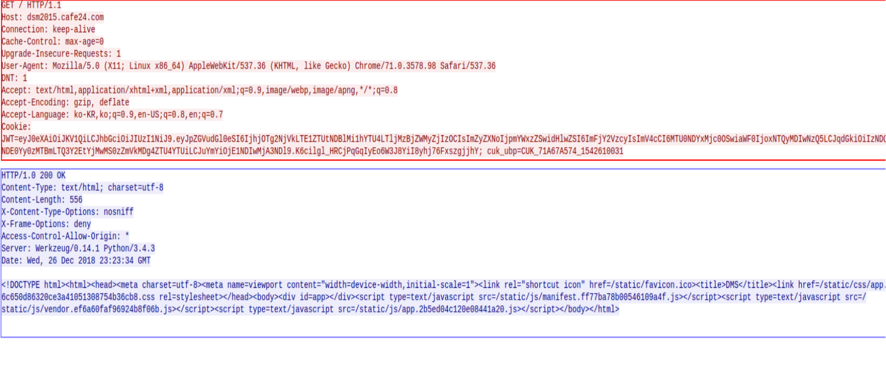

# HTTP
## HTTP/ 1.1

(Hypertext Transfer Protocol)

TCP위에서 작동하는 프로토콜로 이미지, 동영상,오디오, 등등을 보낼 수 있다.

---
### working structure

> client : URI를 이용하여 서버에 접속하고 데이터를 요청할 수 있다 
>>ex)chrome, firefox, IE

> server : client의 요청을 받아서 해석, 응답을 하는 소프트웨어가 설치된 컴퓨터 
>> ex) Apache, nginx, IIS, lighttpd

>표준 포트는 80번
---
### Connectionless

연결하고 Request하고 Response를 한후 접속이 끊긴다 
- 이를 보안하기위해 Ajax와 Web Socket을 사용한다

또한 통신이 끝나면 현재 상태가 저장되지 않는다
- 이를 보한하기 위해 쿠키나 세션이 나왔다.

---
### HTTP Stream

- RED : Request
- BLUE : Response

### Request Packet

#### Request-line
>| Method | URI | Version |
>|:------:|:---:|--------:|
>|GET| / | HTTP/1.1|
     HTTP 1.1 버전으로 서버의 루트 디렉토리로 GET요청을 보낸다

>Method의 종류
>>| Method | Remark | Need Body |
>>|:--------|:--------:|:--------:|
>>| GET | 서버에서 Data를 가져온다 | X |
>>| HEAD | 서버에서 Data의 헤더만 가져온다 | X |
>>| POST | 서버에서 Data에 대해 어떤 처리를 요청  |O|
>>| PUT |   서버에서 요청 바디를 저장함 | O |
>>| TRACE | 메세지가 서버에 도달하는 과정을 추적 | X |
>>| OPTIONS | 서버가 어떤 메서드를 수행할 수 있는지 확인 | X |
>>| DELETE | 서버에서 데이타를 삭제한다 | X |

#### Head
* Main Items

|  | Remark | In Example |
|:---|:---:|:---|
|Host| URI | dms2015.cafe24.com|
| From | client mail | X |
| Cookie | 클라이언트에 저장되는 키와 값이 들어 있는 작은 데이터 파일| JWT
|Referer| 바로 직전에 머물렀던 페이지를 저장|X|
|User-Agent| 브라우저 정보| Mozilla/5.0 (X11; Linux x86_64) AppleWebKit/537.36 (KHTML, like Gecko) Chrome/71.0.3578.98 Safari/537.36
|Accept| 원하는 미디어 타입 및 우선순위를알려줌 |text/html, application/xhtml+xml,application/xml; q=0.9,image/webp,image/apng,*/*;q=0.8
|Accept-Charset|원하는  문자 집합 | X |
|Accept-Encoding|원하는 문자 인코딩 방식 |gzip, deflate|
|Accept-Language| 자신이 원하는 가능한 언어 | ko-KR,ko;q=0.9,en-US;q=0.8,en;q=0.7
>Accept에서 q는 가중치
---

