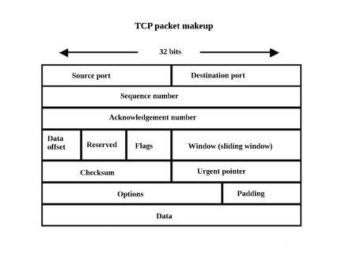

# TCP

## Transmission Control Protocol

전송 계층에서 동작하는 연결 지향형 프로토콜,
데이터의 흐름을 관리하고 데이터가 정확한지 판단한다

## Feature

- High Reliable

- [Virtual Circuit](https://en.wikipedia.org/wiki/Virtual_circuit)

- connect / disconnect

- Data Checksum

- Time Out / Retransmission

- Data Stream Control

## Packet Structure

|field|Byte|instruction| etc |
|:--:|:--:|:--:|--:|
| S.port | 2byte | 출발지 [포트](###Port) 번호(0~65535) |
| D.port | 2byte | 도착지 포트 번호 |
| Sequence Number | 4byte | 패킷의 순서 값 |
| Acknowledgement Number | 4byte | 통신 상대의 패킷 순서 값 |
| [Data Offset](###Data-Offset) | 4bites | 패킷 해더 길이 |
| Reserved | 6bits | 사용하지 않음 |
| [Control Bits](###Control-Bits) | 6bits | 패킷의 종류/특성 |
| Window | 2byte | 한번에 데이터를 받을 수 있는양 |
| Checksum | 2byte | 오류 검출을 위한 값 |
| Urgent Pointer | 2byte | Control Bits가 URG인 경우 데이터의 마지막 바이트 위치 |아마 Option때문에 끝을 몰라서 그런게 아닐까?|
| Options | Dynamic | [LINK](https://tools.ietf.org/html/rfc2018) |
| Padding | Dynamic | Option이 32bit가 안되면 나머지는 0으로 채운다 |
| Data | Dynamic | 전송하고자 하는 데이터를 저장한다 |

### Port

> port 란 application을 구별하기 위한 번호

### Data Offset

> Data Offset에서 패킷 해더 길이를 계산하려면 4(4byte)를 곱해야 한다

### Control Bits

|URG|ACK|PSH|RST|SYN|FIN|
|:--:|:--:|:--:|:--:|:--:|:--:|
|Urgent|확인 번호 필드 유효|높은 처리율 요구|연결 재설정|연결 요청, 설정/확인 응답 순서 동기화| 연결 종료|
